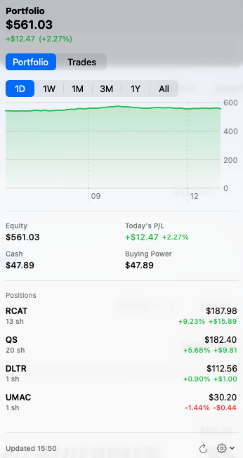

<p align="center">
  
</p>

# Alpaca Portfolio Monitor

[](https://github.com/dimitryvin/alpaca-portfolio-monitor/actions/workflows/release.yml)

A lightweight macOS **menu bar** app that shows your [Alpaca](https://alpaca.markets)
brokerage portfolio value and today's change at a glance. Click the menu bar item for a
popover with an equity chart, key stats, your open positions, and your trade history with
realized P/L.

> **Read-only.** The app only issues `GET` requests to Alpaca and never places trades.

<p align="center">
  <br><br>
  
</p>

## Download

Install with [Homebrew](https://brew.sh):

```bash
brew install --cask dimitryvin/tap/alpaca-portfolio-monitor
```

Or grab the latest `.dmg` from [Releases](https://github.com/dimitryvin/alpaca-portfolio-monitor/releases),
open it, and drag the app to **Applications**. Builds are signed with a Developer ID and
notarized by Apple, so they open normally.

To build a release `.dmg` yourself: `scripts/release.sh 1.0.0` (add `--publish` to upload to GitHub).
To produce a signed + notarized build, set `SIGN_ID` and `NOTARY_PROFILE` first:

```bash
SIGN_ID="Developer ID Application: Your Name (TEAMID)" NOTARY_PROFILE="AlpacaNotary" \
  scripts/release.sh 1.0.0 --publish
```

Or push a `v*` tag to build, sign, notarize, and publish automatically via GitHub Actions
(`.github/workflows/release.yml`). Configure the required secrets once with
`scripts/setup-ci-secrets.sh`, then `git tag v1.1.0 && git push origin v1.1.0`.

## Features

- Menu bar text: portfolio value + today's change %, tinted green/red
  (e.g. `$12,345  ▲1.2%`), shown immediately on launch.
- **Portfolio** tab:
  - Equity chart and a range picker (1D / 1W / 1M / 3M / 1Y / All).
  - Key stats: equity, today's P/L ($ and %), cash, buying power.
  - Positions list: market value and **unrealized P/L since entry** per holding.
- **Trades** tab: executed fills, newest first, with **realized P/L on sells**
  (computed from average-cost basis) and a total realized P/L.
- Auto-refreshes every 60 seconds, plus a manual refresh button.
- **Open at Login** toggle (via `SMAppService`).
- Credentials stored securely in the macOS Keychain (never logged).

## Requirements

- macOS 14+ (built on macOS 26 / Xcode 26, Swift 6).
- [XcodeGen](https://github.com/yonyz/XcodeGen): `brew install xcodegen`.
- A **live** Alpaca account API key + secret
  ([create one here](https://app.alpaca.markets/account/profile)).

## Build & run

```bash
# 1. Generate the Xcode project from project.yml
xcodegen generate

# 2. Build
xcodebuild -project AlpacaPortfolioMonitor.xcodeproj \
  -scheme AlpacaPortfolioMonitor -configuration Debug build

# 3. Launch the built app (path printed by the build under DerivedData),
#    or just open it in Xcode and press Run:
open AlpacaPortfolioMonitor.xcodeproj
```

On first launch a setup popover asks for your API Key ID and Secret. They are validated
with a single `GET /v2/account` call, then saved to the Keychain. Use the gear menu in the
popover to **Change API Keys** or **Quit**.

## Run tests

```bash
xcodebuild test -project AlpacaPortfolioMonitor.xcodeproj -scheme AlpacaPortfolioMonitor
```

## Notes

- The app is **live-only** (`https://api.alpaca.markets`).
- It runs as an agent app (no Dock icon) via `LSUIElement`.
- Local/automatic signing is sufficient for personal use.

## Project layout

```
project.yml                 XcodeGen spec (the .xcodeproj is generated, not committed)
Sources/
  App/                      @main app + Info.plist
  Models/                   Codable models + chart range mapping
  Services/                 Alpaca client, Keychain store, observable store
  Views/                    Menu bar label, popover, chart, stats, positions, setup
Tests/                      Parsing + calculation unit tests
```
